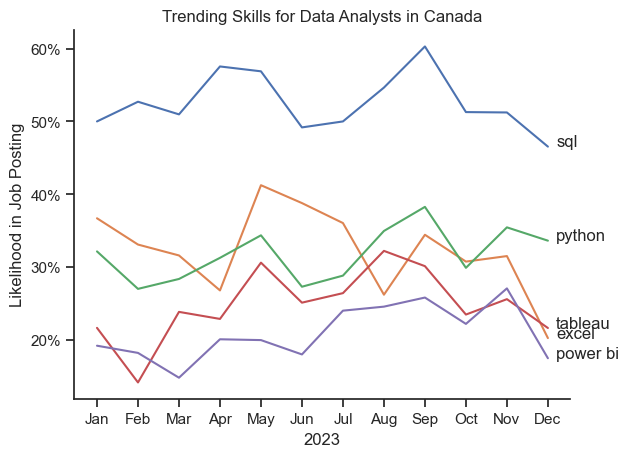
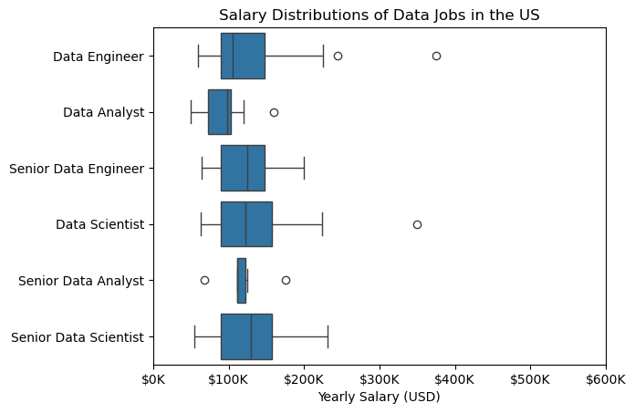
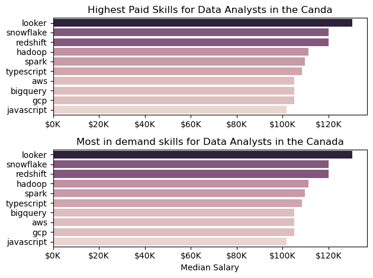
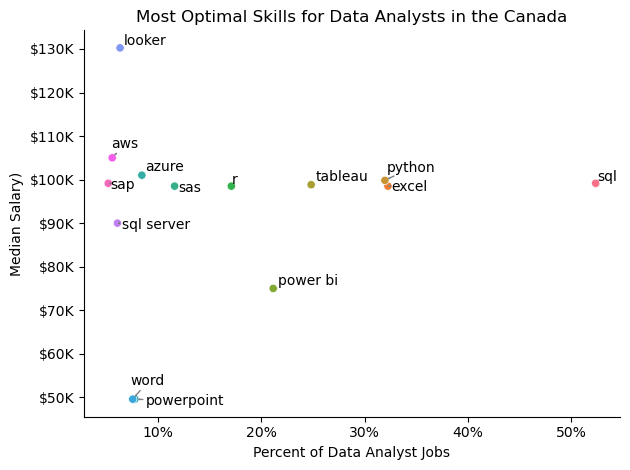

TODO: Need to fill this in

# The Analysis

## 1. What are the most demanded skills for the top 3 most popular data roles in Canada?

View my notebook with detailed steps here:
[2_luke_Skill_Demand.ipynb](3_Project/2_luke_Skill_Demand.ipynb) 


### Visualize Data
```python
fig, ax = plt.subplots(len(job_titles), 1)

for i, job_title in enumerate(job_titles):
    df_plot = df_merge[df_merge.job_title_short==job_title].sort_values(by = 'job_prob', ascending = False).head(5)
    sns.barplot(data = df_plot, x = 'job_prob', y = 'job_skills', ax= ax[i], hue = 'job_prob', palette='light:b')
    ax[i].set_title(job_title)
    ax[i].set_ylabel('')
    ax[i].set_xlabel('')
    ax[i].set_xlim(0,70)
    ax[i].legend().set_visible(False)

    for num, val in enumerate(df_plot.job_prob):
        # plt.text
        ax[i].text(val, num, f'{val}%', va = 'center')

    ax[i].set_xticks([])

fig.suptitle('Likelihood of skills by Job Postings', fontsize = 15)
fig.tight_layout(h_pad = 0.5)

plt.show()
```

### Results


### Insights
1. SQL is the most universally required skill, topping the list for both Data Analysts (52.39%) and Data Engineers (65.1%), and ranking second for Data Scientists (49.64%).
2. Python is in high demand across all roles, appearing in the top three for each: Data Engineers (61.2%), Data Scientists (61.26%), and Data Analysts (31.97%).
3. Data Engineers show the most demand for cloud and big data tools, with Azure (38.04%), AWS (34.83%), and Spark (33.42%) appearing in their top five — not present in the Analyst or Scientist roles at the same level.
4. Data Analysts still heavily rely on traditional tools, with Excel (32.26%) and Power BI (21.14%) being more relevant for them than for other data roles.
5. Data Scientists uniquely require statistical and visualization tools, with R (28.16%) being notable for them, while AWS and Tableau appear at lower percentages (both under 17%), indicating a broader but more specialized skill expectation.


## 2. How are in-demand skills trending for Data Analysts?

View my notebook with detailed steps here:
[3_luke_Skill_Trend.ipynb](3_Project/3_luke_Skill_Trend.ipynb) 

### Visualize Data
```python
sns.lineplot(data = df_DA_CA_percent, dashes = False, legend = 'full')
sns.set_theme(style='ticks')
sns.despine()

plt.title('Trending Skills for Data Analysts in Canada')
plt.ylabel('Likelihood in Job Posting')
plt.xlabel('2023')
plt.legend().remove()
ax = plt.gca()

from matplotlib.ticker import PercentFormatter
ax.yaxis.set_major_formatter(PercentFormatter(decimals=0))

for i in range(5):
    plt.text(11.2, df_DA_CA_percent.iloc[-1,i], df_DA_CA_percent.columns[i])
```

### Results



### Insights
1. SQL remains the dominant skill throughout the year, consistently appearing in over 50% of job postings, peaking at around 60% in September.
2. Python usage showed seasonal spikes, particularly in May and September, suggesting increased demand during hiring cycles or project ramp-ups.
3. Excel and Tableau showed fluctuating relevance, both ranging between 20–30%, with Excel peaking slightly higher in October and Tableau seeing a relative dip in mid-year months.
4. Power BI trailed behind other tools, but maintained a steady presence near 20–25%, indicating it's still valued but secondary compared to SQL and Python.
5. The biggest volatility was observed in Python and Tableau, with Python seeing a sharp increase in May and Tableau showing inconsistent demand — possibly reflecting shifting preferences in data visualization tooling or differing employer tech stacks.


## 3. How well do jobs and skills pay for Data Analysts?

View my notebook with detailed steps here:
[4_luke_Salary_Analysis.ipynb](3_Project/4_luke_Salary_Analysis.ipynb) 

### Visualize Data
```python
sns.boxplot(data = df_CA, x = 'salary_year_avg', y = 'job_title_short')
plt.title('Salary Distributions of Data Jobs in the US')
plt.xlabel('Yearly Salary (USD)')
plt.ylabel('')
plt.xlim(0, 600000) 
ticks_x = plt.FuncFormatter(lambda y, pos: f'${int(y/1000)}K')
plt.gca().xaxis.set_major_formatter(ticks_x)
plt.show()
```

### Results


### Visualize Data
```python
fig, ax = plt.subplots(2,1)

sns.barplot(data = df_top_paid_skills, x = 'median_salary', y = 'job_skills', ax = ax[0], hue = 'median_salary')
ax[0].set_title('Highest Paid Skills for Data Analysts in the Canda')
ax[0].set_ylabel('')
ax[0].set_xlabel('')
ax[0].legend().set_visible(False)
ax[0].xaxis.set_major_formatter(plt.FuncFormatter(lambda x,pos: f'${int(x/1000)}K'))


sns.barplot(data = df_demand_skills, x = 'median_salary', y = 'job_skills', ax = ax[1], hue = 'median_salary')
ax[1].set_title('Most in demand skills for Data Analysts in the Canada')
ax[1].set_ylabel('')
ax[1].set_xlabel('Median Salary')
ax[1].set_xlim(ax[0].get_xlim())
ax[1].legend().set_visible(False)
ax[1].xaxis.set_major_formatter(plt.FuncFormatter(lambda x, pos: f'${int(x/1000)}K'))

plt.tight_layout()
plt.show()
```

### Results



### Insights
1. Senior roles significantly increase compensation potential — with Senior Data Scientists and Senior Data Engineers having the widest and highest salary ranges (up to or beyond $200K–$300K USD).
2. Data Scientists and Data Engineers (non-senior) show more favorable medians and wider ranges compared to Data Analysts, indicating better compensation growth in more technical roles.
3. Data Analysts have the lowest salary range, with many roles offering between $70K–$120K USD, and outliers barely exceeding $150K.
4. Looker, Snowflake, and Redshift are both the highest paying and most in-demand tools for Data Analysts in Canada — suggesting that mastering modern BI and cloud data platforms is highly rewarded.
5. Skills like Spark, Hadoop, and TypeScript bridge both value and demand, making them great upskilling areas for Data Analysts aiming to earn more and stay market-relevant.


## 4. What is the most optimal skill to learn for Data Analysts?

View my notebook with detailed steps here:
[5_luke_Optimal_skills.ipynb](3_Project/5_luke_Optimal_skills.ipynb) 

### Visualize Data
```python
sns.scatterplot(data = df_skills, x = 'job_percent', y = 'median_salary', hue = df_skills.index)
sns.despine()


# Prepare texts for adjustText
texts = []
for i, txt in enumerate(df_skills.index):
    texts.append(plt.text(df_skills['job_percent'].iloc[i], df_skills['median_salary'].iloc[i], txt))

from adjustText import adjust_text

# Adjust text to avoid overlap
adjust_text(texts, arrowprops=dict(arrowstyle='->', color='gray'))

plt.xlabel('Percent of Data Analyst Jobs')
plt.ylabel('Median Salary)')  # Assuming this is the label you want for y-axis
plt.title('Most Optimal Skills for Data Analysts in the Canada')

from matplotlib.ticker import PercentFormatter
ax = plt.gca()
ax.yaxis.set_major_formatter(plt.FuncFormatter(lambda y, pos: f'${int(y/1000)}K'))  # Example formatting y-axis
ax.xaxis.set_major_formatter(PercentFormatter(decimals=0))

plt.legend().remove()
plt.tight_layout()
plt.show()
```

### Results


### Insights
1. SQL is the most in-demand skill for Data Analysts, appearing in over 50% of job postings, while still offering a competitive median salary (~$95K) — making it essential for entry and long-term value.
2. Looker offers the highest median salary (~$130K) but appears in less than 10% of job postings, suggesting it's a high-pay, low-supply niche skill worth mastering for standout candidates.
3. Python and Excel strike a strong balance, being both widely used (30–40% of roles) and offering solid median salaries (~$98K–$100K) — excellent core tools for generalist Data Analysts.
4. Power BI has moderate demand (20%) but the lowest relative median salary ($75K) among common visualization tools, indicating lower ROI compared to Tableau or even Excel.
5. Tools like AWS, Azure, and SAP offer high salaries (~$100K–$110K) but appear in only 10–15% of roles, making them great upskilling options for analysts looking to transition into more technical or hybrid cloud/data engineering roles.


# Conclusion

SQL is the most in-demand skill across all data roles — appearing in 65.1% of Data Engineer, 52.4% of Data Analyst, and 49.6% of Data Scientist job postings — making it a foundational requirement. Python closely follows, with over 61% demand among Engineers and Scientists, and 32% for Analysts, reflecting its cross-functional utility.

Data Engineers lead in cloud and big data tools: Azure (38%), AWS (35%), and Spark (33%), while Data Analysts still lean on traditional tools like Excel (32%) and Power BI (21%). Data Scientists prioritize specialized tools like R (28%) and show more diversity in tooling.

Salary trends reveal that senior roles pay significantly higher — with Senior Data Scientists and Engineers earning up to $300K, compared to $70K–$120K for most Data Analysts.

For Data Analysts in Canada, Looker commands the highest median salary (~$130K) but appears in under 10% of postings. Meanwhile, SQL offers a strong ~$95K median salary and is present in 50%+ of jobs, making it high-value and widely accessible.

Balancing popular tools like Python, Excel, and Tableau (30–40% demand, ~$98K–$100K salary) with premium skills like Snowflake, Redshift, and cloud platforms can significantly enhance both employability and earnings potential.