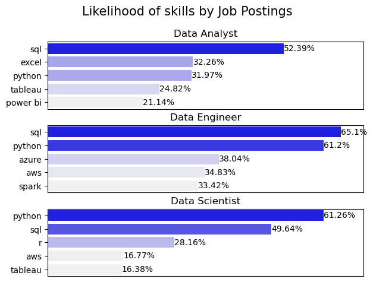

TODO: Need to fill this in

# The Analysis

## What are the most demanded skills for the top 3 most popular data roles in Canada?

#### Methodology
1. Clean-up skill column
2. Calculate skill count based on `job_title_short`
3. Calculate skill percentage
4. Plot final findings

View my notebook with detailed steps here:
[2_luke_Skill_Demand.ipynb](3_Project/2_luke_Skill_Demand.ipynb) 


### Visualize Data
```python
fig, ax = plt.subplots(len(job_titles), 1)

for i, job_title in enumerate(job_titles):
    df_plot = df_merge[df_merge.job_title_short==job_title].sort_values(by = 'job_prob', ascending = False).head(5)
    sns.barplot(data = df_plot, x = 'job_prob', y = 'job_skills', ax= ax[i], hue = 'job_prob', palette='light:b')
    ax[i].set_title(job_title)
    ax[i].set_ylabel('')
    ax[i].set_xlabel('')
    ax[i].set_xlim(0,70)
    ax[i].legend().set_visible(False)

    for num, val in enumerate(df_plot.job_prob):
        # plt.text
        ax[i].text(val, num, f'{val}%', va = 'center')

    ax[i].set_xticks([])

fig.suptitle('Likelihood of skills by Job Postings', fontsize = 15)
fig.tight_layout(h_pad = 0.5)

plt.show()
```

### Results



### Insights
1. SQL is the most universally required skill, topping the list for both Data Analysts (52.39%) and Data Engineers (65.1%), and ranking second for Data Scientists (49.64%).
2. Python is in high demand across all roles, appearing in the top three for each: Data Engineers (61.2%), Data Scientists (61.26%), and Data Analysts (31.97%).
3. Data Engineers show the most demand for cloud and big data tools, with Azure (38.04%), AWS (34.83%), and Spark (33.42%) appearing in their top five — not present in the Analyst or Scientist roles at the same level.
4. Data Analysts still heavily rely on traditional tools, with Excel (32.26%) and Power BI (21.14%) being more relevant for them than for other data roles.
5. Data Scientists uniquely require statistical and visualization tools, with R (28.16%) being notable for them, while AWS and Tableau appear at lower percentages (both under 17%), indicating a broader but more specialized skill expectation.
